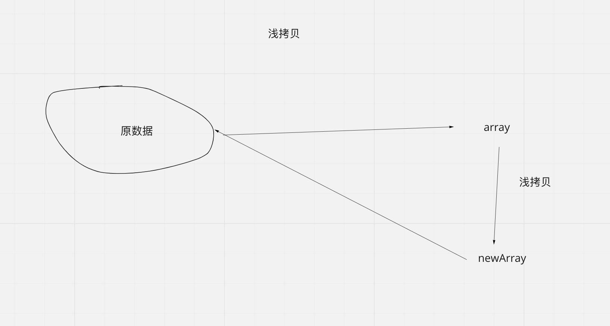
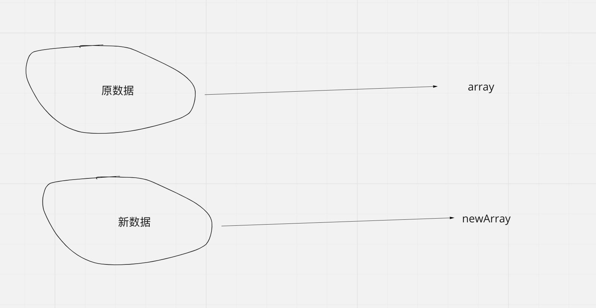
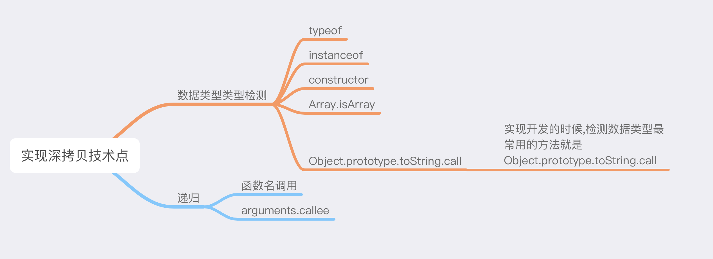

# 面试题文档

## 一、JavaScript面试题

### 1.1 什么是浅拷贝? 什么是深拷贝?

#### 1.1.1 浅拷贝: 

> **浅拷贝**只复制指向某个对象的指针，而不复制对象本身，新旧对象还是共享同一块内存

所谓的浅拷贝就是将原数据重新进行二次赋值, 当我们修改了现引用数据类型的内容, 原引用数据类型的内容也会发生变化



```javascript
// 浅拷贝 //特点： 共享同一内存    指针指向同一地址
let array = ["vue", "javascript", "react"]
let newArray = array
newArray[0] = "123"
console.log("原数组", array)
console.log("新数组", newArray)


// 对象浅拷贝
let obj = {name : "jack", age : 20}
let newObj = obj
newObj.age = 100
console.log("old obj" , obj)
console.log("new obj" , newObj)

```


#### 1.1.2 深拷贝:



> **深拷贝**会另外创造一个一模一样的对象，新对象跟原对象不共享内存，修改新对象不会改到原对象

所谓的深拷贝就是将数据重新进行复制, 复制的之后的数据与原数据没有任何关联,当我们修改新数据的时候, 原数据不会发生变化

```javascript
// 检测数据类型方法
    function getDataType(arg) {
        // 检测变量的数据类型
        let dataType = Object.prototype.toString.call(arg); // [object String]

        let mapType = {
            '[object Boolean]': 'boolean',
            '[object Number]': 'number',
            '[object String]': 'string',
            '[object Function]': 'function',
            '[object Array]': 'array',
            '[object Date]': 'date',
            '[object RegExp]': 'regExp',
            '[object Undefined]': 'undefined',
            '[object Null]': 'null',
            '[object Object]': 'object'
        }

        return mapType[dataType]
    }
    
    function deepCopy(p) {
        var obj;
        var str = getDataType(p);
        if (str == 'array') {
            obj = [];
            for (var i = 0; i < p.length; i++) {
                obj.push(arguments.callee(p[i]));
            }
        } else if (str == 'object') {
            obj = {};
            for (var i in p) {
                obj[i] = arguments.callee(p[i]);
            }
        } else {
            return p;
        }
        return obj;
    }
    
    var array = ["vue", 1, undefined, true, null, function test(){}, {age : 1}, ["html","css"]]
    var data = deepCopy(array)
    data[6].age = 100
    data[7][0] = "git"
    console.log("old",array)
    console.log("new", data)
```

#### 1.1.3 实现深拷贝注意的点:

1. **JSON.parse(JSON.stringify()) 在深拷贝函数以及undefined的类型时候会有问题, 会将undefined拷贝为null, 而函数无法完整拷贝**
2. **使用Object.assign方法实现拷贝时, 如果对象的数据只有一层的时候, 可以实现深拷贝, 如果对象的数据有多层的时候,Object.assign对深层的数据无法进行深拷贝**

#### 1.1.4 实现完整深拷贝涉及到的知识点



